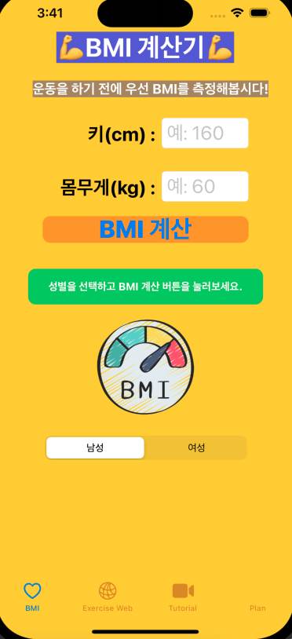
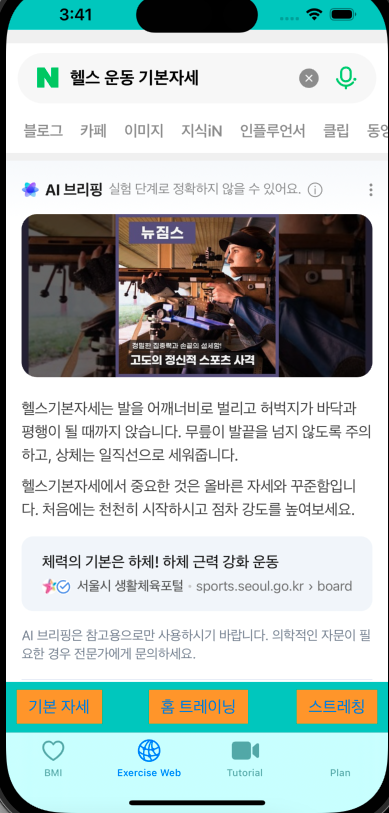
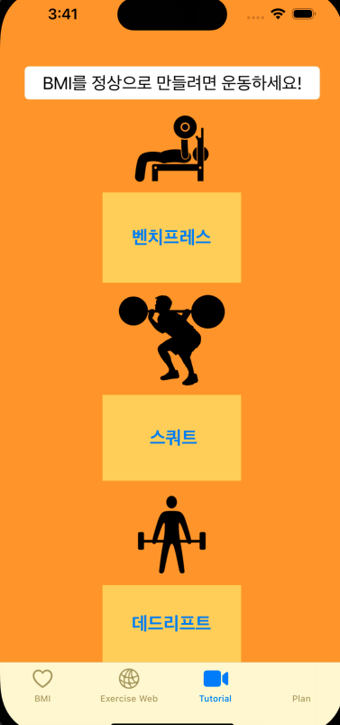
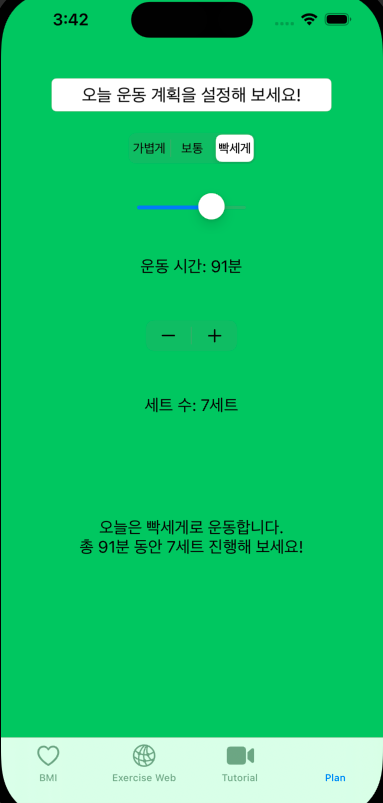
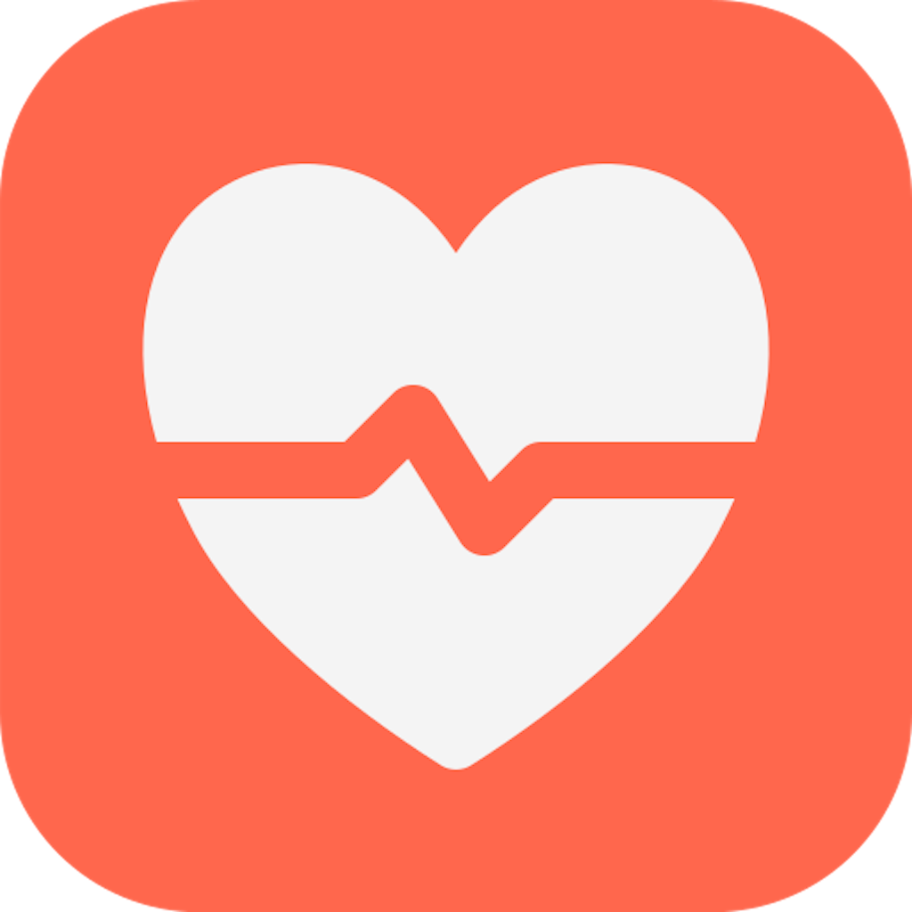
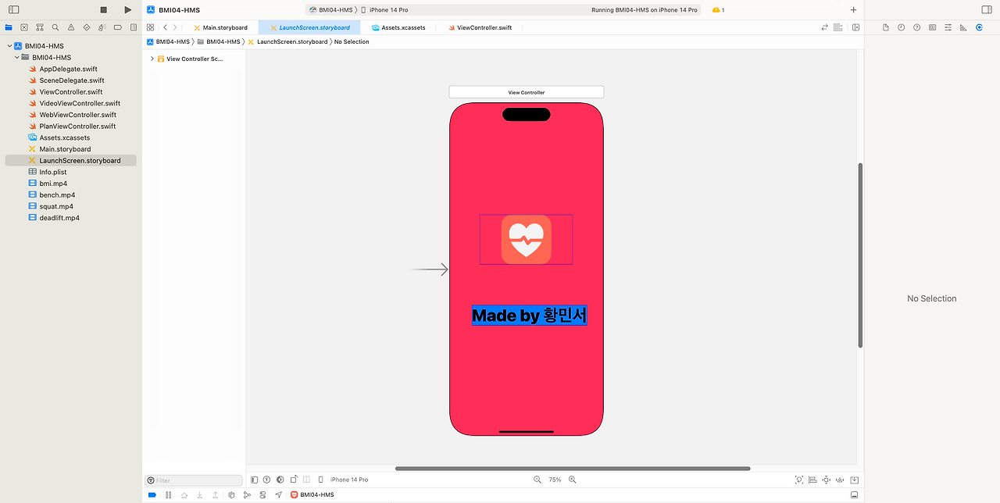

# HealthyUp iOS

HealthyUp iOS는 UIKit과 Storyboard를 활용해 BMI 계산, 운동 정보 탐색, 운동 영상 재생, 운동 계획 설정 기능을 탭 기반으로 구성한 iOS 건강 관리 앱입니다.

iOS 프로그래밍 기초 학습 과정에서 제작했으며, BMI 계산 결과를 확인한 뒤 운동 정보 탐색, 운동 영상 확인, 운동 계획 설정으로 이어지는 사용 흐름을 구성하는 데 초점을 두었습니다.

## 앱 화면

| BMI 계산 | 운동 정보 | 운동 영상 |
| --- | --- | --- |
|  |  |  |

| 운동 계획 | 앱 아이콘 | Launch Screen |
| --- | --- | --- |
|  |  |  |

## 프로젝트 개요

앱의 주요 흐름은 `BMI 계산 → 운동 정보 탐색 → 운동 영상 확인 → 운동 계획 설정`입니다. 단일 계산 화면에서 끝나지 않고, 결과 확인 이후 사용자가 운동 관련 정보를 찾아보고 직접 운동 계획을 조정하는 흐름을 구성했습니다.

앱명은 `HealthyUp iOS`로 정리했으며, 내부 Xcode 프로젝트 폴더명 `BMI04-HMS`는 과제 제출 당시의 기존 구조를 유지합니다.

## 주요 기능

- 키와 체중 입력 기반 BMI 계산
- 성별 선택에 따른 정상 BMI 범위 분기
- BMI 결과별 상태 문구와 색상 피드백 표시
- `WKWebView`를 통한 운동 관련 외부 검색 결과 탐색
- `AVKit`과 `AVPlayerViewController` 기반 로컬 운동 영상 재생
- `UISlider`, `UIStepper`, `UISegmentedControl`을 이용한 운동 계획 설정
- 앱 아이콘과 Launch Screen 적용

## 기술 스택

| 구분 | 사용 기술 |
| --- | --- |
| Language | Swift |
| UI | UIKit, Storyboard |
| Navigation | Tab Bar Controller |
| Web | WebKit |
| Video | AVKit |
| IDE | Xcode |

## 주의 사항

BMI 판정 기준은 학습용 예시 기준이며 의료적 판단을 대체하지 않습니다. 실제 건강 상태 판단은 전문가 상담이나 공신력 있는 기준을 참고해야 합니다.

영상 자료는 학습 및 과제 시연 목적으로 사용했습니다. 공개 포트폴리오에서는 저작권 문제가 없도록 직접 제작한 자료 또는 출처가 명확한 자료를 사용하는 것을 목표로 합니다.

## 실행 방법

```bash
git clone https://github.com/allen8524/healthyup-ios.git
cd healthyup-ios
```

1. `BMI04-HMS.xcodeproj` 파일을 Xcode에서 엽니다.
2. 실행 대상 기기를 iPhone Simulator로 선택합니다.
3. Xcode 상단의 Run 버튼을 눌러 앱을 실행합니다.

## 프로젝트 구조

```text
HealthyUp-iOS/
├── BMI04-HMS/
│   ├── ViewController.swift
│   ├── WebViewController.swift
│   ├── VideoViewController.swift
│   ├── PlanViewController.swift
│   ├── bench.mp4
│   ├── squat.mp4
│   ├── deadlift.mp4
│   ├── bmi.mp4
│   ├── Assets.xcassets
│   ├── Main.storyboard
│   └── LaunchScreen.storyboard
├── BMI04-HMS.xcodeproj
├── docs/
│   ├── FEATURES.md
│   ├── IMPROVEMENTS.md
│   └── screenshots/
└── README.md
```

| 파일 | 역할 |
| --- | --- |
| `ViewController.swift` | BMI 계산, 성별 기준 분기, 결과별 UI 피드백을 담당합니다. |
| `WebViewController.swift` | `WKWebView`로 운동 관련 외부 검색 결과를 앱 내부에서 표시합니다. |
| `VideoViewController.swift` | 번들에 포함된 로컬 mp4 운동 영상을 `AVPlayerViewController`로 재생합니다. |
| `PlanViewController.swift` | 운동 강도, 시간, 세트 수 입력값에 따라 운동 계획 요약 문구를 갱신합니다. |
| `Assets.xcassets` | 앱 아이콘과 화면에서 사용하는 이미지 리소스를 관리합니다. |
| `docs/screenshots` | README에 표시할 앱 화면 이미지를 보관합니다. |

## 상세 문서

- [기능 정리](docs/FEATURES.md)
- [개선 계획](docs/IMPROVEMENTS.md)

## 개선 계획

운동 정보 로컬 데이터화, BMI 기록 저장, 사용자별 운동 목표 저장, HealthKit 연동 가능성 검토 등을 개선 방향으로 두고 있습니다. 자세한 내용은 [개선 계획](docs/IMPROVEMENTS.md) 문서에 정리했습니다.
